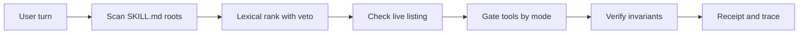

<div align="center">

# 🛡️ Skill Proof <sub>v0.4.1</sub>

**Local skill routing for Hermes agents: deterministic selection, tool gating, truthful receipts**

*Python 3.11, stdlib only, offline, zero external calls, 7 hooks*

[](https://github.com/Stxyu-p/skill-proof/releases)
[](LICENSE)
[](https://github.com/NousResearch/hermes-agent)


</div>

---

## ⚡ Overview

**Skill Proof** answers three questions on every turn: which skill was chosen, why it won, and what evidence backs the claim.

Each user turn scans the configured `SKILL.md` roots, picks one skill with deterministic lexical ranking, gates operational tools by mode, and appends a short receipt to the response. No model call. No network. No vector database. Python 3.11 with stdlib only.

What a typical turn looks like:

```text
[Skill Proof: python-tdd | loaded | compliance verified]
```

When something needs attention, the receipt says so and points at the detail:

```text
[Skill Proof: none | not loaded | missing_required_tool:terminal; see /skill-proof explain]
```

Five commands inspect the evidence: `/skill-proof status`, `explain`, `trace`, `refresh`, `health`.

---

## 🌟 Why Skill Proof?

Picking a skill from the prompt alone fails in predictable ways. The wrong skill loads, unavailable skills get suggested anyway, a veto still selects the vetoed skill, short queries match inside longer words, and load claims carry no evidence.

**Skill Proof routes differently:**

- 🎯 **Deterministic ranking:** explicit `$name`, `skill:name`, and English or Thai phrase requests take precedence. Ties request disambiguation instead of silently dropping a skill.
- 🚫 **Veto handling in English and Thai:** excluded skills leave the ranking with a `negated_skill` receipt instead of becoming the selection.
- 🔍 **Token-boundary phrase matching:** short queries stop matching inside longer words. Thai text without word spaces keeps substring matching.
- 🧾 **Truthful receipts:** lifecycle event, source hash, and tool-result hash behind every claim. Prompts and skill bodies are never stored.
- 🛡️ **Progressive gating plus invariant checks:** `observe`, `nudge`, and `enforce-tools` modes with `required`, `forbidden`, and `ordered` tool rules.

## 📊 Feature Comparison

| Capability | Without Skill Proof | 🛡️ **Skill Proof** |
| :--- | :---: | :--- |
| **Skill selection** | Guesswork, no audit trail | ✅ **Deterministic lexical rank with a per-turn receipt** |
| **Unavailable skills** | Suggested even when unlisted | ✅ **Checked against the live listing, receipt `not_in_hermes_list`** |
| **Veto requests** | `don't use X` still selects X | ✅ **Veto excludes X, receipt `negated_skill`** |
| **Short queries** | `ui` matches inside `build` | ✅ **Token-boundary matching, Thai spaceless keeps substring** |
| **Load evidence** | Claimed in prose | ✅ **Lifecycle event plus source and result hashes** |
| **Tool gating** | None | ✅ **`observe`, `nudge`, `enforce-tools`** |
| **Execution compliance** | Never checked | ✅ **Required, forbidden, and ordered invariants, `verified` or `failed`** |
| **External calls** | Varies | ✅ **Zero, stdlib only, fully offline** |

---

## 🧭 Architectural Dataflow



How a turn is decided, in plain language:

1. Explicit `$name` or `skill:name` wins. A vetoed explicit name falls back to lexical ranking.
2. Phrase and tag matches score against fixed thresholds (`min_score` 0.28, `min_margin` 0.05).
3. Vetoed names are excluded with reason `negated_skill`.
4. Names outside the live listing resolve to `not_in_hermes_list` with no selection.
5. Ties, unknown names, and multiple requests return no selection with a named reason.
6. No match allows ordinary work. Only `enforce-tools` mode blocks operational tools.

---

## 🚀 Key Modules and Engineering Advantages

| Component | What It Does | Technical Advantage |
| :--- | :--- | :--- |
| **Lexical Ranker** | Scores name, description phrase, and tags against score and margin thresholds | Deterministic, no model call, no network |
| **Negation Guard** | Detects English and Thai veto phrasing around a skill name | A veto never becomes a selection |
| **Phrase Matcher** | Token-boundary match for spaced text, substring for Thai spaceless text | Short queries stop matching inside longer words |
| **Listing Check** | Matches local names against the live skill listing every turn | Unavailable skills stay visible as filtered, never loaded silently |
| **Tool Gate** | `observe`, `nudge`, `enforce-tools` (`enforce` is an alias) | Progressive strictness, discovery tools always allowed |
| **Receipt Engine** | Compact or verbose footer plus `status`, `explain`, `trace`, `refresh`, `health` | Every claim carries evidence, last 20 receipts retained |
| **Invariant Verifier** | `required_tools`, `forbidden_tools`, `ordered_tools` from frontmatter or config | Violations fail compliance with a named reason, `enforce-tools` blocks outright |
| **Cache** | Metadata-keyed reuse of parsed skills, at most 100 completed turns | Normal edits detected next turn, `refresh` forces a reread |

---

## 📊 System Footprint

| Metric | Measured Value | Note |
| :--- | :--- | :--- |
| **Python files** | 12 | Core, hooks, benchmarks, 7 test files |
| **Python lines** | 3,069 | Includes tests and benchmarks |
| **Tests** | 73 passing, 2 skipped | `python -m unittest discover -s tests` |
| **Routing cases** | 12 of 12 | `routing_benchmark.py`, zero false selections |
| **Hooks** | 7 | Pre and post LLM, pre and post tool, transform, lifecycle, session end |
| **External dependencies** | 0 | Stdlib only |
| **Network calls** | 0 | Fully offline at runtime |

---

## ⚙️ Modes and Configuration

| Mode | Behavior |
| :--- | :--- |
| `observe` | Suggests a candidate and records events, tools remain allowed |
| `nudge` (default) | Requests loading before operational tools, tools remain allowed |
| `enforce-tools` | Blocks operational tools until a selected skill has a load event |

| Command | What It Shows |
| :--- | :--- |
| `/skill-proof status` | Compact state for the latest turn |
| `/skill-proof explain` | Selection decision and ranked candidates |
| `/skill-proof trace` | Full bounded JSON receipt |
| `/skill-proof refresh` | Reread local skill content on the next turn |
| `/skill-proof health` | Hook activity, catalog diagnostics, and timing |

Skills declare invariants in `SKILL.md` frontmatter:

```yaml
---
name: my-skill
description: ...
invariants:
  required_tools: [terminal]
  forbidden_tools: [git_push]
  ordered_tools: [terminal, write_file]
---
```

Or centrally in `config.yaml`:

```yaml
plugins:
  entries:
    skill-proof:
      settings:
        invariants:
          test-driven-development:
            required_tools: [terminal]
            ordered_tools: [terminal, write_file]
          codebase-inspection:
            forbidden_tools: [write_file, patch]
```

Key settings: `mode` (default `nudge`), `skill_roots` (must already be readable through `skill_view`), `visible_receipt` (default `true`), `receipt_style` (`compact` or `verbose`, trace always carries full evidence), `receipt_history_limit` (default 20).

---

## 📦 Installation and Setup

| Method | Source | Notes |
| :--- | :--- | :--- |
| **Git clone** | [Repo](https://github.com/Stxyu-p/skill-proof) | `git clone https://github.com/Stxyu-p/skill-proof.git`, copy into place |
| **Manual** | This directory | Copy to the active profile `plugins/skill-proof`, run `hermes plugins enable skill-proof`, start a new session |

Quick start in four steps:

1. Copy this directory to the active profile `plugins/skill-proof`.
2. Run `hermes plugins enable skill-proof` and start a new session.
3. Merge these settings into the existing configuration and keep other enabled plugins:

```yaml
plugins:
  enabled:
    - skill-proof
  entries:
    skill-proof:
      settings:
        mode: nudge
        skill_roots:
          - C:/Users/BlankScreen/AppData/Local/hermes/skills
        visible_receipt: true
        receipt_history_limit: 20
```

4. Ask for a skill, then run `/skill-proof explain` to see the decision and the evidence.

Use explicit roots for custom profiles. Start with `nudge` and inspect `explain` before enabling tool gating.

---

## 🆕 What Is New in v0.4.1

- **Negation guard**: vetoes such as `don't use X`, `without X`, `ไม่เอา X`, or `ไม่ใช้ X` exclude that skill from ranking. A vetoed `$name` falls back to lexical ranking, fully vetoed turns report `no_match/negated_skill`.
- **Token-boundary phrase matching**: short queries such as `ui` no longer match inside longer words like `build`. Thai text without word spaces keeps substring matching.
- **Listing check locked by a regression test**: lexical matches outside the live listing resolve to `not_in_hermes_list` with no selection.
- **Health reports the correct plugin version** (0.4.1).

Prior releases: v0.4.0 added invariant compliance verification (`required`, `forbidden`, `ordered` tools). v0.3.1 fixed Thai conjoined-skill detection and action-continuation false matches. v0.3 added `health` timing, diagnostics, and block-scalar frontmatter support.

---

## 🔬 Evidence and Limitations

- `loaded=yes` means a matching successful lifecycle event was observed, not proof of the exact bytes served or of task success.
- `active=yes` means an operational tool was requested after that event, another gate can still block execution.
- Compliance without invariants stays `unassessed`, satisfied invariants report `verified`.
- The local source hash is a filesystem recheck, tool hashes observe results before later output transforms.
- Lifecycle events carry no turn IDs, so correlation is session and task scoped.
- Thai matching is lexical and phrase based, with no word segmentation or embeddings.
- Routing fixtures are synthetic English and Thai examples. No production accuracy claim is supported.
- Synthetic core results live in `VALIDATION.md` and exclude listing overhead.
- Stored per turn: hashes, event flags, and bounded receipts. Stored never: prompts and skill bodies.

---

## 📁 Project Structure

| Path | Purpose |
| :--- | :--- |
| `core.py` | Ranking, negation guard, phrase matching, gating, receipts, invariants |
| `__init__.py` | Hook wiring, commands, 7 hook registrations |
| `plugin.yaml` | Manifest, version 0.4.1, config schema |
| `tests/` | Discovery, ranking, gating, evidence, and isolation suites, 7 files |
| `routing_benchmark.py`, `routing_cases.json` | Representative synthetic routing cases, 12 of 12 passing |
| `benchmark.py` | Synthetic core performance probe |
| `host_smoke.py` | Optional live listing and filter check against the host source |
| `VALIDATION.md` | Synthetic benchmark notes and scope limits |

---

## 🧪 Verification and Automated Testing

Run from this directory:

```powershell
python -m unittest discover -s tests -v
python -m py_compile __init__.py core.py
hermes plugins doctor . --ci
python benchmark.py
python routing_benchmark.py
```

**Verification Status:** **73 tests passing (2 skipped), 12 of 12 routing cases, doctor OK as standalone with 7 hooks.**

---

## 📄 License

Distributed under the [MIT License](LICENSE).
Copyright (c) 2026 P Choke & SORA.

<div align="center">

**Skill Proof** <sub>v0.4.1</sub> · Built for deterministic routing

*Local-first, Auditable, Gated, Governed*

</div>
