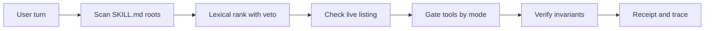

<div align="center">

# 🛡️ Skill Proof <sub>v0.8.0</sub>

**Local skill routing for Hermes agents: deterministic selection, tool gating, truthful receipts**

*Python 3.11, stdlib only, offline, zero external calls, 7 hooks*

[](https://github.com/Stxyu-p/skill-proof/releases)
[](CHANGELOG.md)
[](LICENSE)
[](https://github.com/NousResearch/hermes-agent)


</div>

---

## ⚡ Overview

**Skill Proof** answers three questions on every turn: which skill was chosen, why it won, and what evidence backs the claim.

Each user turn scans the configured `SKILL.md` roots, picks one skill with deterministic lexical ranking, gates operational tools by mode, and appends a short receipt to the response. The session also remembers what it selected, so *use the same skill*, *อันที่แล้ว*, and *keep using X* resolve against that history instead of guessing. No model call. No network. No vector database. Python 3.11 with stdlib only.

What a typical turn looks like:

```text
[Skill Proof: python-tdd | loaded | compliance verified]
```

When something needs attention, the receipt says so and points at the detail:

```text
[Skill Proof: none | not loaded | missing_required_tool:terminal; see /skill-proof explain]
```

Six commands inspect the evidence: `/skill-proof status`, `explain`, `why <name>`, `trace`, `refresh`, `health`.

---

## 🌟 Why Skill Proof?

Picking a skill from the prompt alone fails in predictable ways. The wrong skill loads, unavailable skills get suggested anyway, a veto still selects the vetoed skill, short queries match inside longer words, and load claims carry no evidence.

**Skill Proof routes differently:**

- 🎯 **Deterministic ranking:** explicit `$name`, `skill:name`, and English or Thai phrase requests take precedence. Ties request disambiguation instead of silently dropping a skill.
- 🚫 **Veto handling in English and Thai:** excluded skills leave the ranking with a `negated_skill` receipt instead of becoming the selection.
- 🔍 **Token-boundary phrase matching:** short queries stop matching inside longer words. Thai text without word spaces keeps substring matching.
- 🧾 **Truthful receipts:** lifecycle event, source hash, and tool-result hash behind every claim. Prompts and skill bodies are never stored.
- 🧭 **Truthful availability:** Windows junctions and other reparse points are classified instead of silently rejected, and a Hermes-listed skill with no local source reports `listed_but_unindexed` instead of `unknown`.
- 🔗 **Provenance-aware:** the hub lock is cross-checked read-only; receipts carry trust level, scan verdict, pinned revision, and a `match`/`modified`/`unknown` bundle verdict (hash algorithm verified against live lock entries).
- 🌍 **Language-agnostic matching:** `aliases:` and `synonyms` work in any script — Thai, CJK, Hangul and other spaceless scripts match by substring, spaced scripts keep token boundaries.
- 🧠 **Multi-turn memory:** session history answers *use the same skill* and *อันที่แล้ว*, a bounded focus keeps the current skill in play for `focus_turns` turns, and both fail closed with a named reason when there is no history to answer from.
- ❓ **Answerable decisions:** `/skill-proof why <name>` gives the exact score, threshold, gap to the top, matching terms, or the veto that kept a skill out — from stored numbers, never from prompt text.
- 📒 **Append-only audit:** one derived-numbers JSON line per turn (`audit_log`), rotated by `audit_limit`, with prompts and skill bodies never written to disk.
- 🧳 **Beyond Hermes:** the core is host-independent; a portable CLI and a stdlib stdio MCP server bring the same selection engine to Claude Code, Codex, Antigravity, Cursor, Gemini CLI, and any MCP-capable host.
- 🛡️ **Progressive gating plus invariant checks:** `observe`, `nudge`, and `enforce-tools` modes with `required`, `forbidden`, and `ordered` tool rules.

## 📊 Feature Comparison

| Capability | Without Skill Proof | 🛡️ **Skill Proof** |
| :--- | :---: | :--- |
| **Skill selection** | Guesswork, no audit trail | ✅ **Deterministic lexical rank with a per-turn receipt** |
| **Unavailable skills** | Suggested even when unlisted | ✅ **Checked against the live listing, receipt `not_in_hermes_list`** |
| **Veto requests** | `don't use X` still selects X | ✅ **Veto excludes X, receipt `negated_skill`** |
| **Short queries** | `ui` matches inside `build` | ✅ **Token-boundary matching, Thai spaceless keeps substring** |
| **Load evidence** | Claimed in prose | ✅ **Lifecycle event plus source and result hashes** |
| **Tool gating** | None | ✅ **`observe`, `nudge`, `enforce-tools`** |
| **Execution compliance** | Never checked | ✅ **Required, forbidden, and ordered invariants, `verified` or `failed`** |
| **External calls** | Varies | ✅ **Zero, stdlib only, fully offline** |
| **Hub provenance** | Load claims have no supply-chain context | ✅ **Trust level, scan verdict, pinned revision, bundle `match`/`modified`** |
| **Non-Hermes hosts** | Locked to one agent platform | ✅ **Portable CLI plus stdio MCP server over the same engine** |
| **Follow-up turns** | Every turn starts from zero | ✅ **Session history, `same skill`/`อันที่แล้ว` references, bounded focus with expiry** |
| **Asking why** | Re-reading prose and guessing | ✅ **`/skill-proof why` with exact score, threshold, gap, and veto list** |
| **Decision history** | Nothing retained | ✅ **Append-only JSONL audit of derived numbers, rotated by limit** |

---

## 🧭 Architectural Dataflow



How a turn is decided, in plain language:

1. Explicit `$name` or `skill:name` wins. A vetoed explicit name falls back to lexical ranking.
2. Without an explicit name, a dialogue reference (*same skill*, *keep using X*, *อันที่แล้ว*) resolves against session history and fails closed when there is no history.
3. Phrase and tag matches score against fixed thresholds (`min_score` 0.28, `min_margin` 0.05); an active focus adds a bounded, decaying bonus to a skill that already has lexical signal, and carries it (`focus_fallback`, score 0) only when nothing else matched.
4. Vetoed names are excluded with reason `negated_skill`; a release (`stop using X`) drops the focus and routes the rest of the sentence.
5. Names outside the live listing resolve to `not_in_hermes_list` with no selection.
6. Ties, unknown names, and multiple requests return no selection with a named reason.
7. No match allows ordinary work. Only `enforce-tools` mode blocks operational tools.

---

## 🚀 Key Modules and Engineering Advantages

| Component | What It Does | Technical Advantage |
| :--- | :--- | :--- |
| **Lexical Ranker** | Scores name, description phrase, and tags against score and margin thresholds | Deterministic, no model call, no network |
| **Negation Guard** | Detects English and Thai veto phrasing around a skill name | A veto never becomes a selection |
| **Phrase Matcher** | Token-boundary match for spaced text, substring for Thai spaceless text | Short queries stop matching inside longer words |
| **Listing Check** | Matches local names against the live skill listing every turn | Unavailable skills stay visible as filtered, never loaded silently |
| **Tool Gate** | `observe`, `nudge`, `enforce-tools` (`enforce` is an alias) | Progressive strictness, discovery tools always allowed |
| **Receipt Engine** | Compact or verbose footer plus `status`, `explain`, `trace`, `refresh`, `health` | Every claim carries evidence, last 20 receipts retained |
| **Invariant Verifier** | `required_tools`, `forbidden_tools`, `ordered_tools` from frontmatter or config | Violations fail compliance with a named reason, `enforce-tools` blocks outright |
| **Alias Matcher** | `aliases:` frontmatter plus `synonyms` config, any script | Language-agnostic recall without embeddings or dictionaries |
| **Session Memory** | Per-session skill history and a decaying focus bonus | `same skill` / `อันที่แล้ว` / `keep using X` resolve deterministically and fail closed without history |
| **Explain Engine** | `/skill-proof why` over a bounded rank table and veto list | Exact per-skill score and gap with no prompt read or returned |
| **Audit Log** | One JSON line per turn, append-only with tail rotation | Derived numbers only; a broken path stops logging instead of failing a turn |
| **Hub Provenance** | Read-only cross-check against the local hub lock | `trust_level`, `scan_verdict`, pinned revision, bundle drift |
| **Portable Entrypoints** | `cli.py` (`roots`/`scan`/`select`) and `mcp_server.py` (stdio JSON-RPC) | The same deterministic engine outside Hermes, stdlib only |
| **Cache** | Metadata-keyed reuse of parsed skills, at most 100 completed turns | Normal edits detected next turn, `refresh` forces a reread |

---

## 📊 System Footprint

| Metric | Measured Value | Note |
| :--- | :--- | :--- |
| **Python files** | 20 | Core, hooks, benchmarks, CLI, MCP server, 12 test files |
| **Python lines** | 7,378 | Includes tests and benchmarks |
| **Tests** | 226 passing, 2 skipped | `python -m unittest discover -s tests` |
| **Routing cases** | 48 of 48 gated | `routing_benchmark.py --gate`, zero false selections, 5 stretch cases reported |
| **Hooks** | 7 | Pre and post LLM, pre and post tool, transform, lifecycle, session end |
| **External dependencies** | 0 | Stdlib only |
| **Network calls** | 0 | Fully offline at runtime |

---

## ⚙️ Modes and Configuration

| Mode | Behavior |
| :--- | :--- |
| `observe` | Suggests a candidate and records events, tools remain allowed |
| `nudge` (default) | Requests loading before operational tools, tools remain allowed |
| `enforce-tools` | Blocks operational tools until a selected skill has a load event |

| Command | What It Shows |
| :--- | :--- |
| `/skill-proof status` | Compact state for the latest turn, plus focus and reference |
| `/skill-proof explain` | Selection decision, ranked candidates, focus, and session history |
| `/skill-proof why <name>` | Why this skill won, lost, or was vetoed this turn |
| `/skill-proof trace` | Full bounded JSON receipt |
| `/skill-proof refresh` | Reread local skill content on the next turn |
| `/skill-proof health` | Hook activity, catalog diagnostics, and timing |

Skills declare invariants in `SKILL.md` frontmatter:

```yaml
---
name: my-skill
description: ...
invariants:
  required_tools: [terminal]
  forbidden_tools: [git_push]
  ordered_tools: [terminal, write_file]
---
```

Or centrally in `config.yaml`:

```yaml
plugins:
  entries:
    skill-proof:
      settings:
        invariants:
          test-driven-development:
            required_tools: [terminal]
            ordered_tools: [terminal, write_file]
          codebase-inspection:
            forbidden_tools: [write_file, patch]
```

Skills may also declare `aliases:` (inline or block list) in frontmatter, and config `synonyms` can map skill names to extra terms — both accept any language:

```yaml
aliases:
  - caveman
  - ตัวพูดสั้น
  - 文档助手
```

Key settings: `mode` (default `nudge`), `skill_roots` (must already be readable through `skill_view`), `visible_receipt` (default `true`), `receipt_style` (`compact` or `verbose`, trace always carries full evidence), `receipt_history_limit` (default 20), `hub_provenance` (default `true`, read-only hub lock cross-check), `hub_lock_path` (override; empty auto-detects), `synonyms` (skill name to extra matching terms), `session_memory` (default `true`; skill history for dialogue references), `focus_turns` (default 5, range 0-50; `0` keeps a focus until it is released), `audit_log` (default `true`; append the per-turn decision line), `audit_path` (override; empty uses `plugin-data/skill-proof/audit.jsonl`), `audit_limit` (default 500, range 10-10000).

When several roots index the same skill name, the first configured root wins: byte-identical copies collapse as `alias_skipped` (for example a junction facade plus its physical store), divergent copies are reported as `shadowed_by_root`, and same-root collisions stay ambiguous `duplicate_name`.

## 🌐 Beyond Hermes

The engine (`core.py`) has no Hermes imports, so the same deterministic selection and evidence work on any host that can run Python 3.11:

```bash
python cli.py roots                 # detected skill roots (Codex, Claude, Gemini/Antigravity, Cursor, ...)
python cli.py scan                  # catalog summary, diagnostics, canonical root suggestions
python cli.py select --query "ใช้สกิล caveman" --json
```

For MCP-capable hosts (Claude Code, Codex, Antigravity, Cursor, ...), register the stdio server:

```bash
python mcp_server.py
```

It exposes `skill_roots`, `skill_scan`, and `skill_select` over newline-delimited JSON-RPC 2.0, stdlib only, fully offline. `skill_select` returns the decision, the selected skill, and the ranked candidates; roots default to auto-detection and can be passed per call.

---

## 📦 Installation and Setup

| Method | Source | Notes |
| :--- | :--- | :--- |
| **Git clone** | [Repo](https://github.com/Stxyu-p/skill-proof) | `git clone https://github.com/Stxyu-p/skill-proof.git`, copy into place |
| **Manual** | This directory | Copy to the active profile `plugins/skill-proof`, run `hermes plugins enable skill-proof`, start a new session |

Quick start in four steps:

1. Copy this directory to the active profile `plugins/skill-proof`.
2. Run `hermes plugins enable skill-proof` and start a new session.
3. Merge these settings into the existing configuration and keep other enabled plugins:

```yaml
plugins:
  enabled:
    - skill-proof
  entries:
    skill-proof:
      settings:
        mode: nudge
        skill_roots:
          - C:/Users/BlankScreen/AppData/Local/hermes/skills
        visible_receipt: true
        receipt_history_limit: 20
```

4. Ask for a skill, then run `/skill-proof explain` to see the decision and the evidence.

Use explicit roots for custom profiles. Start with `nudge` and inspect `explain` before enabling tool gating.

---

## 📜 Release History & Changelog

All version release notes and historical changes are documented in [CHANGELOG.md](CHANGELOG.md) per Keep a Changelog standards.

---

## 🔬 Evidence and Limitations

- `loaded=yes` means a matching successful lifecycle event was observed, not proof of the exact bytes served or of task success.
- `active=yes` means an operational tool was requested after that event, another gate can still block execution.
- Compliance without invariants stays `unassessed`, satisfied invariants report `verified`.
- The local source hash is a filesystem recheck, tool hashes observe results before later output transforms.
- Lifecycle events carry no turn IDs, so correlation is session and task scoped.
- Session history records the skills Skill Proof selected, cleared at session end; it is not a log of every skill a host loaded on its own.
- Focus is a bounded score bonus, never a tie-breaker: a competing match, a veto, or an ambiguity always wins. Only when nothing else matches does `focus_fallback` (score 0) carry the focused skill, and the context says so.
- Thai matching is lexical and phrase based, with no word segmentation or embeddings.
- Routing fixtures are synthetic English and Thai examples with a gated `core` tier and a reported `stretch` tier. No production accuracy claim is supported.
- Synthetic core results live in `VALIDATION.md` and exclude listing overhead.
- Stored per turn: hashes, event flags, and bounded receipts. Stored never: prompts and skill bodies.
- The audit file (`audit_log`, default on) stores one JSON line of derived numbers per turn and rotates to `audit_limit` lines; it contains `query_sha256`, never query text, and session ids are hashed. `audit_log: false` writes nothing.
- `/skill-proof why` reads only the live in-process turn state; after a restart use `/skill-proof trace`, which holds no prompt either.

---

## 📁 Project Structure

| Path | Purpose |
| :--- | :--- |
| `core.py` | Ranking, negation guard, phrase matching, gating, receipts, invariants |
| `__init__.py` | Hook wiring, commands, 7 hook registrations |
| `plugin.yaml` | Manifest, version 0.8.0, config schema |
| `tests/` | Discovery, ranking, gating, evidence, and isolation suites, 12 files |
| `routing_benchmark.py`, `routing_cases.json` | Labeled routing corpus with tiers, gate, and threshold sweep, 48 of 48 gated passing |
| `benchmark.py` | Synthetic core performance probe |
| `host_smoke.py` | Optional live listing and filter check against the host source |
| `VALIDATION.md` | Synthetic benchmark notes and scope limits |

---

## 🧪 Verification and Automated Testing

Run from this directory:

```powershell
python -m unittest discover -s tests -v
python -m py_compile __init__.py core.py
hermes plugins doctor . --ci
python benchmark.py
python routing_benchmark.py --gate
python routing_benchmark.py --sweep
```

**Verification Status:** **226 tests passing (2 skipped), 48 of 48 gated routing cases (0 false selections), doctor OK as standalone with 7 hooks.**

---

## 📄 License

Distributed under the [MIT License](LICENSE).
Copyright (c) 2026 P Choke & SORA.

<div align="center">

**Skill Proof** <sub>v0.8.0</sub> · Built for deterministic routing

*Local-first, Auditable, Gated, Governed*

</div>
